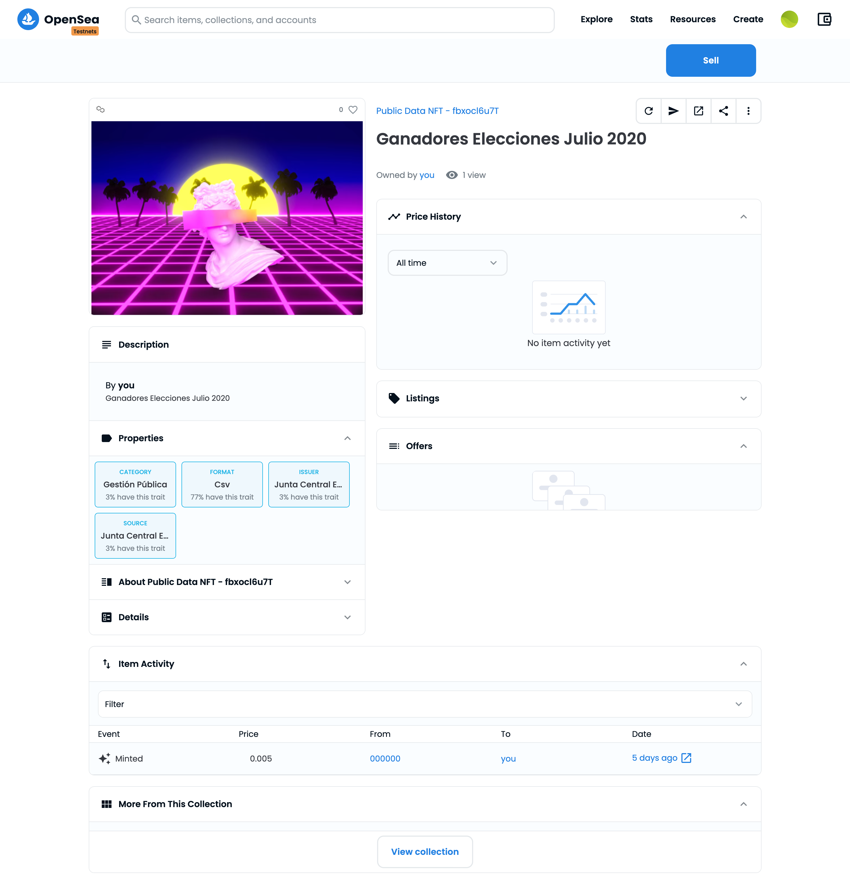

# ⚡ Public Data NFT

## First of All, What's PDNFT (Public Data NFT)?

PDNFT are representations of the underline asset. These represents a Certified Token which can be trade on the open marketplaces like [Opensea](https://opensea.io/).

<figure><figcaption></figcaption></figure>

This feature will allow Aletheia Data to be closer to truly decentralisation. By owning these NFTs not only you're helping growing the network stronger and more decentralised, but also you're contributing to make Aletheia sustainable.&#x20;

Contracts:

* MUMBAI: 0x70f6370eeeFEb9CaAfd9D26305dF032C4E18433e
* GOERLY: coming soon
* NEAR: coming soon


**BE AWARE**: we're only deploying on testnets as for now, not real money will be involved while interacting with out Smart Contracts. You'll receive futher notice before we go live.

