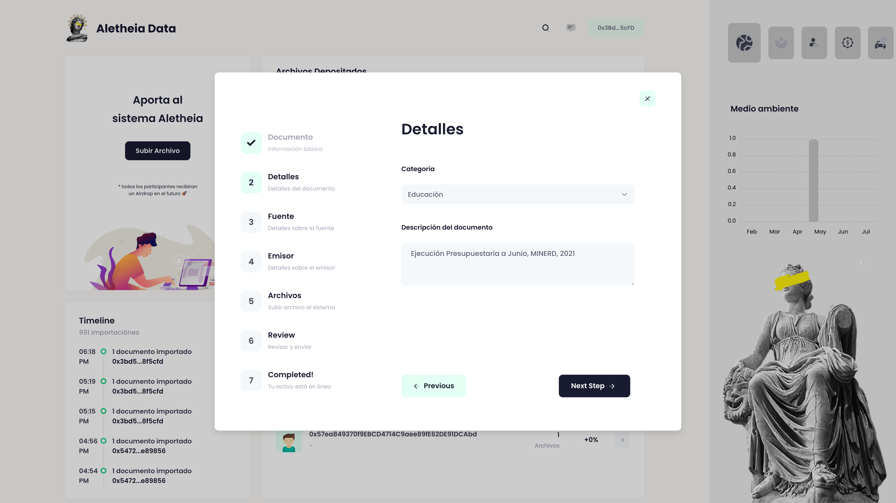
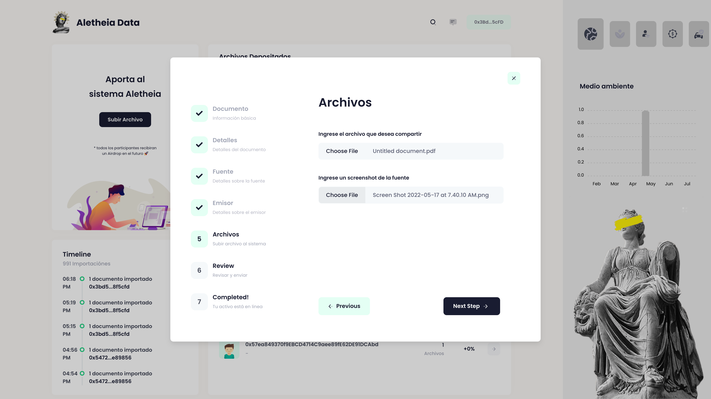
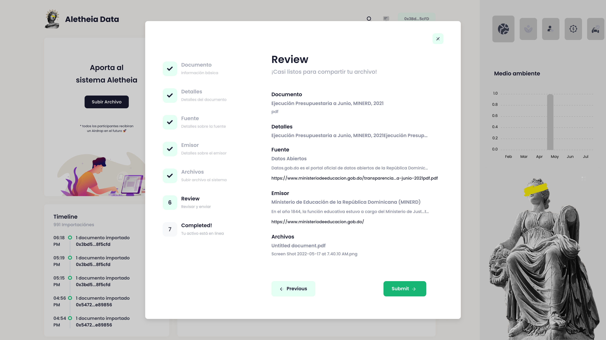

# Uploader

Users can contribute by uploading their own datasets making the system more resilient and useful for the whole community. The more data we have in the system, the more data our community can use for their data needs.&#x20;

Just Pressed "**Subir Archivo**" in homepage to upload assets into the system. Then follow all the step on the Uploader:

1\. Basic Information

2\. Details about the document

3\. Select the source of the document

If you can't find the source you're looking for, create one by checking the "**Crear nuevo**" checkbox

4\. Add the issuer of the document (or create one)

5\. We can now add our files

**Very important**: You'll need to upload a proof (screenshot) of the source, so our community can verify it's a legitimate source.

6\. Review and confirm

Once you're ready to upload the asset to the system press "Submit". You'll be required to sign a Web3 Signature to confirm the transaction into the network.

7\. Congratulations! Just like that you asset gets decentralized and made available to the community.

